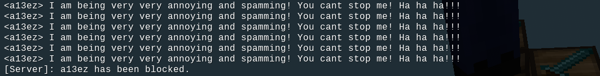

# Player Blocking

<p1> Allows players to block/unblock other annoying players to stop seeing their messages 

## Usage
- `/block <player>`: Blocks the target player. The user will not see any messages from this target player.
- `/unblock <player>`: Unblocks the target player. The user will be able to see messages from the target player.
 

License: MIT 

Found an issue? Report it <a href = "https://github.com/a13ez/block_player/issues">here</a>

